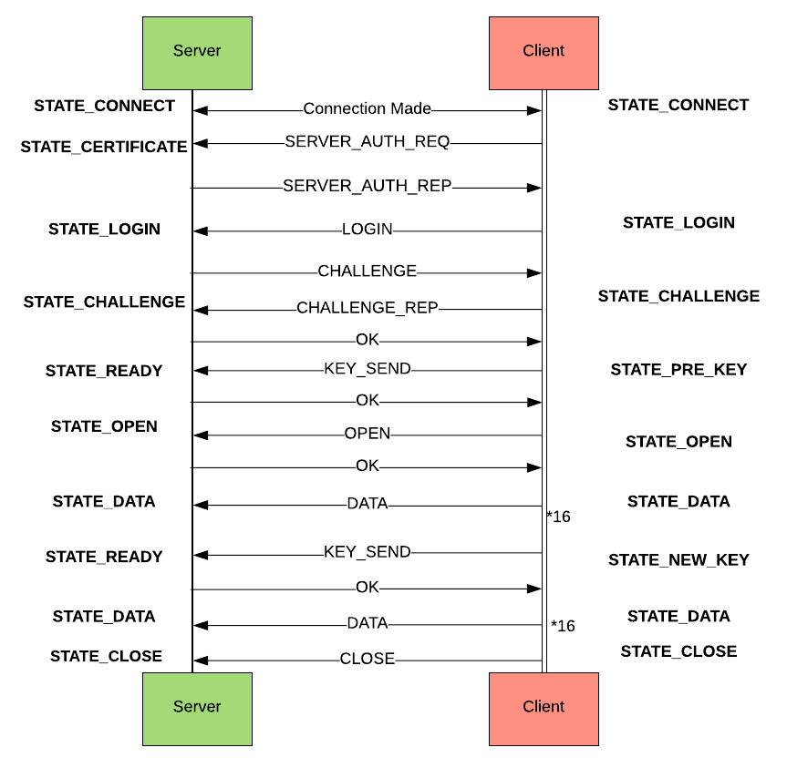

# SecureCommunications

O projeto desenvolvido, conta com um servidor e um cliente cuja finalidade é a de envio de um ficheiro do cliente para o servidor, porém o conteúdo das mensagens enviadas é cifrado para que possa ser interceptado, porém não reconhecido. 

O servidor e o cliente também utilizam um sistema de autenticação e o Servidor possui um controle de autorização para os utilizadores. São utilizados certificados para garantir a autenticidade das entidades e seja por certificados obtidos do cartão de cidadão, seja um certificado próprio do servidor para os seus clientes. Alguns outros mecanismos são melhor exemplificados abaixo,

O projeto baseia-se no segundo Assignment da disciplina, que pode encontrar-se na primeira release. Entretanto, não é mais utilizado a troca de chaves, Diffie–Hellman, mas sim chaves públicas e privadas por meio do RSA.

Para poder utilizar o sistema, é preciso ter os plugins de leitura do cartão de cidadão, ter o certificado no diretório “resources” e adicionar a informação do novo utilizador no ficheiro “users.json”.

Os comandos são: 
python3 server.py 
python3 clienty.py -smartcard <file_path> -a <algorithm>
(file_path- pode-se utilizar o comando -password caso queira utilizar a palavra passe no lugar do cartão de cidadão)
(algorithm - AES ou SALSA20)
   

## Protocolo de Autenticação e Desafio Resposta
O cliente solicita o certificado do servidor, e ao verificar esse certificado, envia o seu nome para executar o login.

O servidor possui em sua base de dados o certificado de todos os utilizadores válidos, é enviado um desafio quando o utilizador tenta executar o login. O cliente assina e retorna a resposta do desafio, que é garantido que apenas o cliente poderia assinar. Existem duas modalidades, planeadas, mas apenas foi implementada com o Smartcard.

### Com Smartcard

Servidor gera um desafio (um valor random nunca antes utilizado (NONCE))
Smartcard do utilizador cifra o desafio com a chave privada
Servidor decifra o resultado com a chave pública e compara com o original
### Com password (Não implementado)

Servidor gera um desafio (NONCE)
Utilizador calcula/transforma o valor com um segredo (password)
    Hash(desafio || password)
Servidor calcula/decifra o resultado e compara com o desafio

## Controle de Acessos
Existem duas modalidades de utilizadores, Administrador e Utilizador, enquanto Administrador ele tem permissões de enviar a quantidade de ficheiros que desejar, enquanto Utilizador, é definido um limite em KB que pode enviar. 

A cada pacote enviado, é adicionado ao contador do utilizador e verificado se o limite foi atingido ou não, na eventualidade do limite ser atingido, o ficheiro enviado é removido, e o contador remove os KBs adicionados, uma mensagem de erro é retornada. A informação desse limite é armazenada internamente pelo servidor. 

A garantia da Autenticação do utilizador é explicada no ponto anterior.

## Envio de Chaves e do Ficheiro

Ao assegurar a autenticidade do cliente, o servidor informa que está preparado para receber o ficheiro, então o cliente envia a chave simétrica utilizada, essa chave é encriptada com a chave pública do servidor, pelo mecanismo de chave hibrida. É enviado também a informação sobre o algoritmo indicado. (Se possuir ou não o vetor inicial). 

A seguir é enviado o nome do ficheiro e o ficheiro em si, sempre com o mac para ser verificado a criptografia e garantir que o ficheiro foi cifrado utilizando a chave correta. Tal como no projeto anterior, a cada 15 KB a chave é atualizada para uma nova.

## Fluxo das Mensagens

## Conteúdo das Mensagens

### Server Messages

{ 'type': 'SERVER_AUTH_REP', 'data': cert.pem }
{ 'type': 'CHALLENGE', 'data': nonce }
{ 'type': 'OK' }
{ 'type': 'ERROR', 'message': Error Details}

### Client Messages
   
{ 'type': 'SERVER_AUTH_REQ' }
{ 'type': 'LOGIN', 'data': user_name}
{ 'type': 'CHALLENGE_REP', 'data': nonce}
{ 'type': 'KEY_SEND', 'key': encripted_key, 'initial_vector': iv}
{ 'type': 'OPEN', 'file_name': cipher_name }
{ 'type': 'DATA', 'data': encripted_file_fragment , 'MAC': signature_cipher&key }
{ 'type': 'CLOSE' }

## Referencias
São Utilizados diversos algoritmos e mecanismos do [cryptography.io](cryptography.io)

Para além das dependências iniciais do projeto fonte, usamos o algoritmo Salsa20 proviniente do [Legrandin](https://github.com/Legrandin/pycryptodome)
